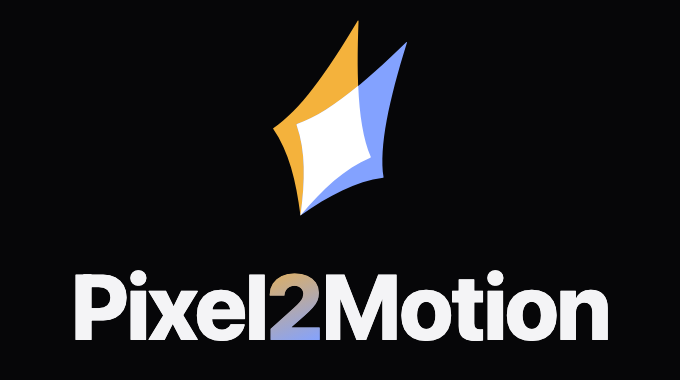
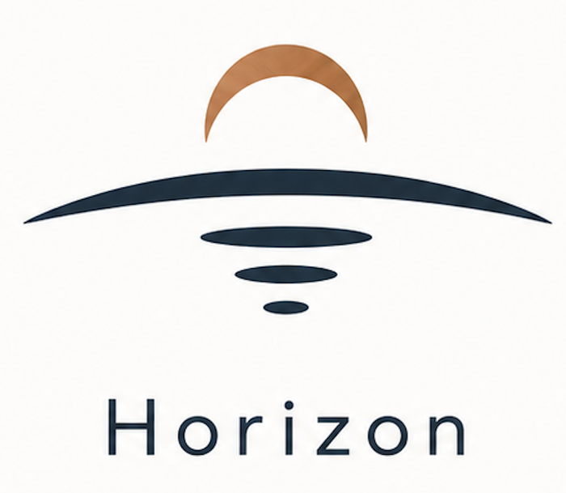
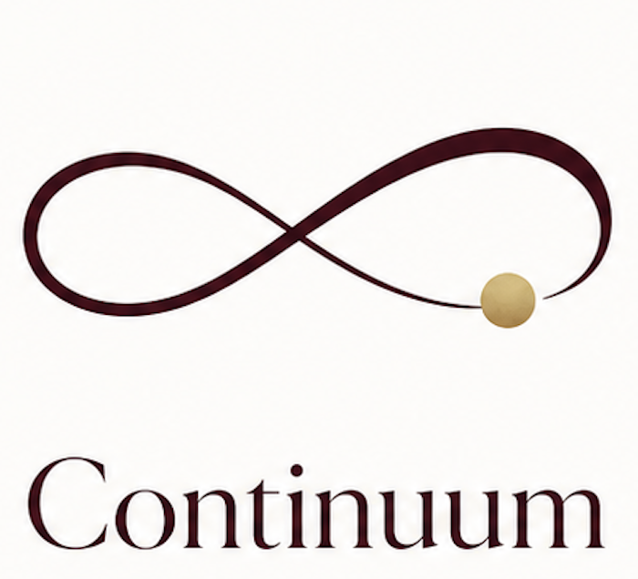
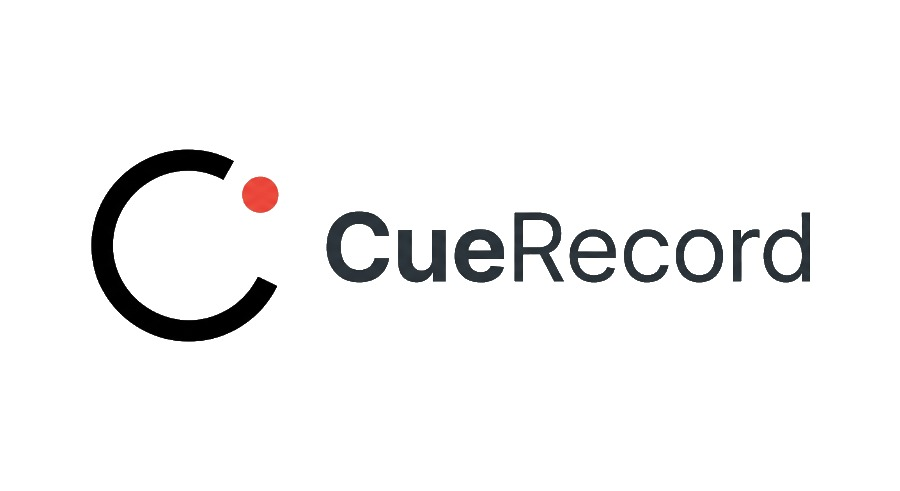
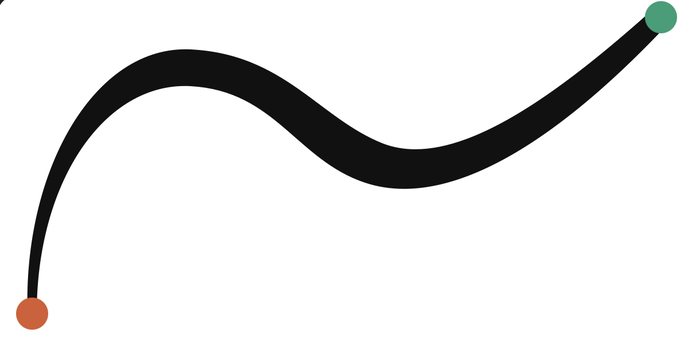
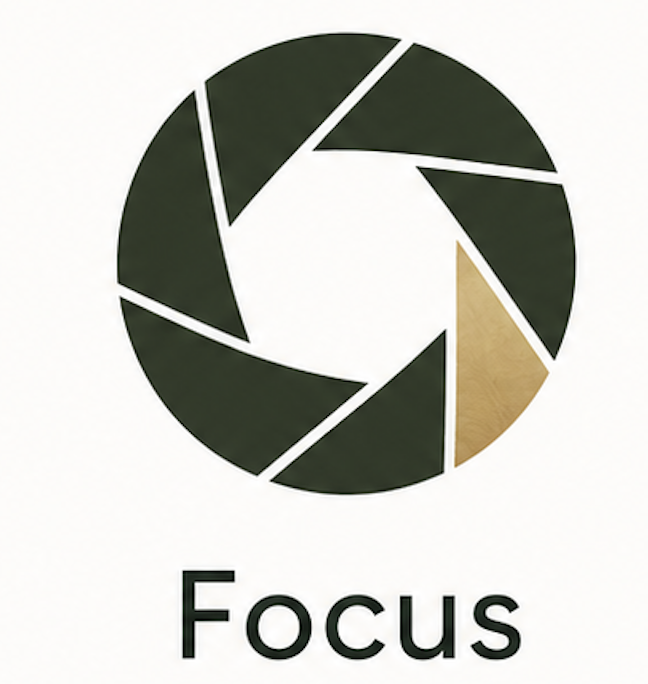
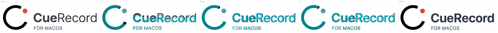

<p align="center">
  <a href="https://www.pixel2motion.com">
    
  </a>
  <br>
  <strong><a href="https://www.pixel2motion.com">www.pixel2motion.com</a></strong>
  <br>
  Better commercial Pixel2Motion services are coming online: polished logo-to-motion workflows, project-ready previews, and production support beyond the open-source skill.
  <br>
  中文：更完整的 Pixel2Motion 商业服务正在上线，面向更稳定的 logo-to-motion 交付、预览和项目支持。
</p>

---

# Pixel2Motion - AI Logo Animation Skill

**Raster logo → smooth minimal SVG → SVG logo animation → interactive HTML motion demo.**

[Commercial preview](https://www.pixel2motion.com) · [Live interactive demo](https://nolangz.github.io/pixel2motion/) · [Skill instructions](https://github.com/nolangz/pixel2motion/blob/main/SKILL.md) · [Companion skill: Pixel2SVG-HTML](https://github.com/nolangz/pixel2svg-html)

Pixel2Motion is an open-source Codex and Claude skill for **logo animation**, **SVG animation**, and AI-assisted brand motion. It turns PNG, JPG, WebP, or screenshot logos into clean motion-ready SVG, then exports animated logo HTML, GIF/video previews, and motion QA evidence. Use it for animated logos, SVG logo reveals, logo motion design, pixel-to-vector reconstruction, and developer-friendly HTML animation workflows.

中文：Pixel2Motion 是一个把像素 logo 转成平滑 SVG，再生成品牌 motion、logo reveal、HTML 动效展示和视频预览的 Codex skill。它适合需要可审查矢量拟合、可复用 SVG 结构和可导出动图/透明视频的设计与开发场景。

Recommended review order: the motion gallery below, the commercial preview, the interactive demo, the fitting evidence, and then the implementation workflow.

## Pixel-to-Motion Gallery

Each pairing shows the raster source next to the motion output, rendered from `docs/index.html` at the animation's default speed: Horizon 1900 ms, Continuum 2000 ms, Focus 1700 ms, N 2400 ms, and CueRecord at the page-default 0.65× custom timeline.

<table>
  <tr>
    <td align="center" width="50%">
      <strong>Horizon</strong><br>
      <sub>Pixel source</sub><br>
      <br>
      <sub>Motion output</sub><br>
      
    </td>
    <td align="center" width="50%">
      <strong>Continuum</strong><br>
      <sub>Pixel source</sub><br>
      <br>
      <sub>Motion output</sub><br>
      
    </td>
  </tr>
  <tr>
    <td align="center" width="50%">
      <strong>CueRecord</strong><br>
      <sub>Pixel source</sub><br>
      <br>
      <sub>Motion output</sub><br>
      
    </td>
    <td align="center" width="50%">
      <strong>N</strong><br>
      <sub>Pixel source</sub><br>
      <br>
      <sub>Motion output</sub><br>
      
    </td>
  </tr>
  <tr>
    <td align="center" width="50%">
      <strong>Focus</strong><br>
      <sub>Pixel source</sub><br>
      <br>
      <sub>Motion output</sub><br>
      
    </td>
    <td align="center" width="50%"></td>
  </tr>
</table>

## Commercial Preview

[](https://www.pixel2motion.com)

The full interactive showcase lives in `docs/index.html` and is published through GitHub Pages at [nolangz.github.io/pixel2motion](https://nolangz.github.io/pixel2motion/). A more polished commercial Pixel2Motion service is coming online at [www.pixel2motion.com](https://www.pixel2motion.com), with project-ready previews and production support beyond the open-source skill.

## Fitting Evidence

Every animation is authored against a QA-verified static vector. The CueRecord fitting sequence, read left to right:



The teal overlays are QA checkpoints, not the deliverable: the vector candidate is repeatedly compared against the raster source until mark scale, dot placement, wordmark baseline, and ink weight hold up — and only then is motion authored on top. The resulting clean semantic SVG, with mark, dot, and wordmark as separate addressable parts, becomes the final-frame contract for the animation.

Pixel2Motion optimizes IoU as a diagnostic, but smoothness and structure are the hard gates. A high-IoU jagged trace is rejected when a lower-complexity smooth vector explains the logo better. The static fitting methodology is documented in full in the companion [Pixel2SVG-HTML](https://github.com/nolangz/pixel2svg-html) project.

## Deliverables

- `logo.svg`: final static vector, structured for motion
- `motion.css`: authored choreography targeting semantic SVG ids
- `logo_motion.html`: dependency-free showcase HTML with replay, slow motion, speed control, QA hooks, and atomic motion studies
- `motion_spec.md`: motion brief, principles applied, timeline, easing tokens, and QA notes
- `outputs/fit_iterations/*.png`: geometry overlay evidence
- `outputs/motion_frames/*.png` and `outputs/motion_strip.png`: deterministic motion QA evidence
- `outputs/final_render.png` and `outputs/html_render.png`: static render checks

## Workflow

1. Read `SKILL.md` and the relevant reference files before fitting or choreographing.
2. Write the motion brief in `motion_spec.md`: personality, usage context, part inventory, and choreography sketch.
3. Fit and QA the static vector:

```bash
python3 scripts/render_overlay.py logo.svg source.png \
  --out outputs/fit_iterations/01_overlay.png \
  --render-out outputs/final_render.png \
  --report outputs/fit_metrics.json
```

4. Audit complex curves when smoothness is a concern:

```bash
python3 scripts/svg_path_audit.py logo.svg \
  --out-svg outputs/bezier_segments.svg \
  --report outputs/bezier_audit.json
```

5. Build the showcase HTML from the verified SVG and authored CSS:

```bash
python3 scripts/animate_svg_showcase.py logo.svg \
  --css motion.css \
  --out logo_motion.html \
  --title "Logo Motion" \
  --duration-hint 1500
```

6. Capture deterministic motion frames:

```bash
python3 scripts/capture_motion_frames.py logo_motion.html \
  --times 0,300,700,1000,1250,1500 \
  --out outputs/motion_frames \
  --strip outputs/motion_strip.png \
  --compare-final outputs/final_render.png
```

7. Probe risky motion windows when the animation uses draw-on, crossings, masks, or handoffs:

```bash
python3 scripts/probe_motion_continuity.py logo_motion.html \
  --times 500,700,900 \
  --probe "#draw-stroke:stroke-dashoffset,#pen-glint:offset-distance"
```

## Requirements

- Python 3.10+
- `Pillow` and `numpy` for image analysis helpers
- Chrome or Chromium for geometry and HTML rendering
- Playwright for deterministic frame capture and motion continuity QA

Recommended local setup:

```bash
python3 -m venv .venv
.venv/bin/pip install pillow numpy playwright
.venv/bin/python -m playwright install chromium
```

If Chrome is not on the default path, set `CHROME_BIN` before running render checks:

```bash
export CHROME_BIN="/Applications/Google Chrome.app/Contents/MacOS/Google Chrome"
```

## Repository Layout

- `SKILL.md`: Codex-facing pixel-to-vector-to-motion workflow
- `agents/openai.yaml`: UI metadata for the skill
- `references/`: animation principles, motion personality, reveal patterns, HTML delivery template, and fitting references
- `scripts/`: helpers for tracing, rendering, overlays, path audits, showcase HTML generation, deterministic frame capture, and motion continuity probing
- `docs/`: GitHub Pages demo, README preview images, GIFs, and fitting-process evidence

## Publishing Checklist

- Confirm `SKILL.md`, `agents/openai.yaml`, `references/`, `scripts/`, and `docs/` are committed.
- Keep generated logo deliverables, motion captures, local virtual environments, caches, and per-logo `outputs/` out of git.
- Enable GitHub Pages from branch `main`, folder `/docs`, after the first push.
- Add a `LICENSE` file before publishing if this repository should grant reuse rights.
- After creating the GitHub repository, add the remote and push:

```bash
git remote add origin git@github.com:<owner>/pixel2motion.git
git branch -M main
git push -u origin main
```

## More From Nolanlai

<p align="center">
  <a href="https://www.nolanlai.com">
    
  </a>
  <br>
  <a href="https://www.nolanlai.com"><strong>www.nolanlai.com</strong></a>
  <br>
  More creative tools, experiments, and notes from Nolanlai.
</p>

<p align="center">
  
  <br>
  <strong>Vibe-Creators 交流</strong>
  <br>
  Vibe-Creators 群已满。扫码加我为好友，我邀请你进群。
  <br>
  The Vibe-Creators group is currently full. Scan the QR code to add me on WeChat, and I can invite you in.
</p>
